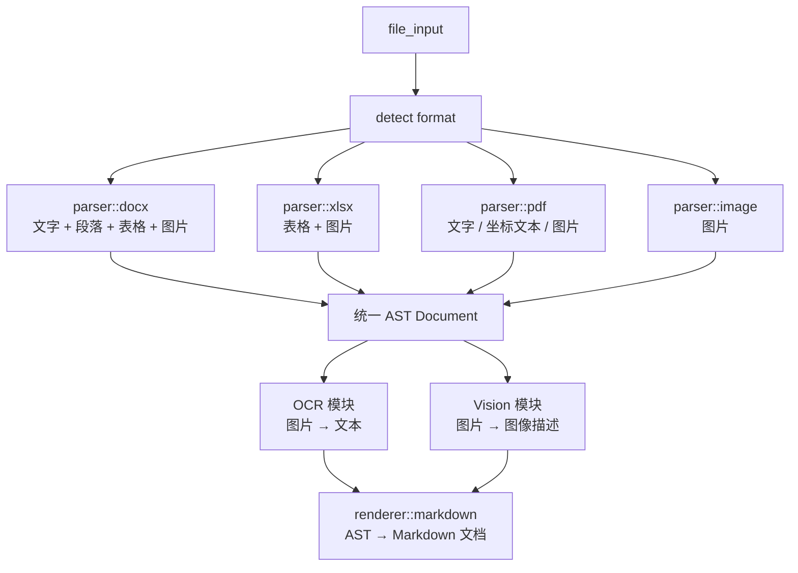

# 🚀 Rust 通用"文件 → Markdown"框架

## 系统架构流程图



### 数据流转过程

1. **文件输入** → 格式检测
2. **解析器模块**：
   - `parser::docx` - 处理文字 + 段落 + 表格 + 图片
   - `parser::xlsx` - 处理表格 + 图片
   - `parser::pdf` - 处理文字 / 坐标文本 / 图片
   - `parser::image` - 处理图片
3. **统一 AST** (Document)
4. **增强处理**：
   - OCR 模块 (图片 → 文本)
   - Vision 模块 (图片 → 图像描述)
5. **渲染输出** → Markdown 文档

### 核心 AST 结构

```rust
Document {
    blocks: Vec<Block>,
}

// 支持的块类型：
Block::Paragraph(String)
Block::Heading(level, String)
Block::Table(TableData)
Block::Image { path, ocr, caption }
```

## 🧩 核心数据结构定义

这是整个系统的核心数据结构。

```rust
#[derive(Debug)]
pub struct Document {
    pub blocks: Vec<Block>,
}

#[derive(Debug)]
pub enum Block {
    Heading { level: u8, text: String },
    Paragraph(String),
    Table(TableData),
    Image {
        path: String,
        ocr_text: Option<String>,
        vision_desc: Option<String>,
    },
}

#[derive(Debug)]
pub struct TableData {
    pub rows: Vec<Vec<String>>,
}
```

## 🏗️ 项目目录结构

```text
src/
├── main.rs                 # 主程序入口
├── lib.rs                  # 库入口文件
├── parser/                 # 解析器模块
│   ├── mod.rs             # 解析器模块定义
│   ├── docx.rs            # Word 文档解析
│   ├── xlsx.rs            # Excel 表格解析
│   ├── pdf.rs             # PDF 文档解析
│   └── image.rs           # 图片文件解析
├── ocr/                   # OCR 文字识别模块
│   ├── mod.rs
│   └── paddleocr.rs       # PaddleOCR 集成
├── vision/                # 视觉理解模块
│   ├── mod.rs
│   └── openai.rs          # OpenAI Vision API 集成
├── renderer/              # 渲染输出模块
│   ├── mod.rs
│   └── markdown.rs        # Markdown 格式输出
├── model/                 # 数据模型定义
│   ├── mod.rs
│   └── ast.rs             # AST 数据结构
└── utils/                 # 工具函数
    └── file.rs            # 文件操作工具
```

## 功能特性

- **多格式支持**: DOCX, XLSX, PDF, 图片文件
- **智能解析**: 自动识别文件格式并选择对应解析器
- **OCR 集成**: 图片中的文字自动识别提取
- **视觉理解**: AI 图像描述生成
- **统一输出**: 标准 Markdown 格式输出
- **模块化设计**: 清晰的架构，易于扩展维护
